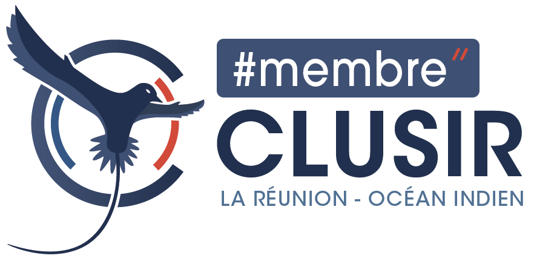

# Cyber Tour Reunion 2026



Site web officiel du **Cyber Tour Reunion 2026**, evenement cybersecurite organise par le [CLUSIR Reunion Ocean Indien](https://www.linkedin.com/company/clusir-roi/) dans le cadre du Cybermois.

**19 — 24 Octobre 2026 | 4 etapes a La Reunion**

## Le Tour

| Jour | Etape | Lieu | Theme |
|------|-------|------|-------|
| Lun 19 | NORD | Campus Moufia | Institutionnel & Table Ronde |
| Mar 20 | OUEST | Office de l'Eau, Le Port | Rencontre Offreurs & Entreprises |
| Mer 21 | EST | Epitech, Saint-Andre | Formations Cyber & Speed Dating |
| Jeu-Ven 22-23 | SUD | Campus IUT/ESIROI, Saint-Pierre | Conferences & Ateliers Techniques |

## Stack

- **Framework** : Astro 6 (SSG)
- **CSS** : Tailwind CSS 4
- **Fonts** : ITC Avant Garde, Ambroise, JetBrains Mono (toutes locales)
- **Deploy** : GitHub Pages via GitHub Actions
- **Docker** : Chainguard Node + Nginx (image 34 MB)
- **Domaine** : [cybertour.re](https://cybertour.re)

## Dev

```bash
npm install
npm run dev      # http://localhost:4321
npm run build    # Build statique dans dist/
```

## Docker

```bash
docker build -t cybertour-web .
docker run -p 8080:8080 cybertour-web
```

## Deploy

Push sur `main` → GitHub Actions build + deploy sur GitHub Pages.

## Contribuer

1. Clone le repo (`git clone git@github.com:thibautfontaine/cybertour-web.git`)
2. Cree une branche depuis `main` (`git checkout -b feat/ma-feature`)
3. Fais tes modifications
4. Commit et push sur ta branche
5. Ouvre une Pull Request vers `main`

## Auteur

Developpe par [Thibaut Fontaine](https://www.linkedin.com/in/thibaut-fontaine) — Membre du bureau du CLUSIR Reunion Ocean Indien, charge de mission communication & evenements.

## Licence

Voir [LICENSE](LICENSE).
